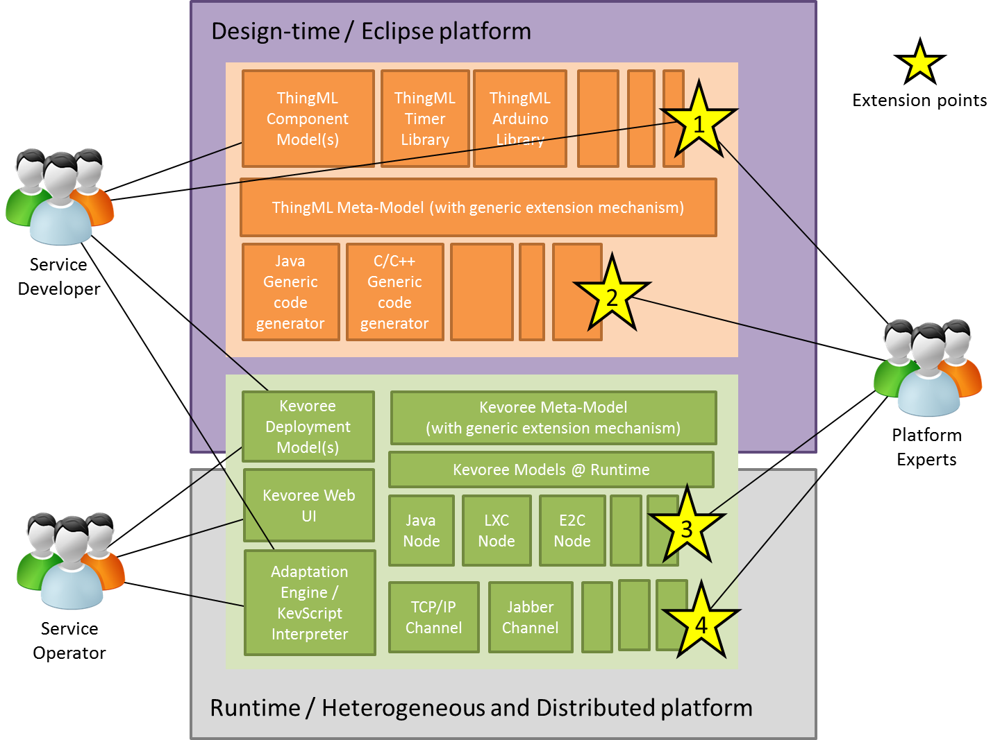

# HEADS IDE

The conceptual architecture of the HEADS IDE together with the main HEADS actors is depicted in the figure below:

The HEADS IDE includes 2 main parts: the design time tools in the top part of the figure and the runtime tools on the bottom part of the figure. Both parts are desrcibed in the following two sub-sections.

The HEADS IDE is meant to be used by the HD-Service developer and the HD-Service operator in order to create, deploy, monitor and evolve HD-Services. The distinction between the service developer and operator is that the developer is mainly concerned with the HEADS design time tools (based on ThingML) and the operator is mainly concerned with the HEADS runtime tools (based on Kevoree).

In addition, the HEADS IDE is meant to be extended by platform experts. The HEADS IDE is built as an open-source framework which has a set of extension points to support new platforms and communication channels. At this point, we have identified 4 extension points which are represented by yellow stars in the figure above. Each of these extension points allows supporting different aspects of a particular target platform.

