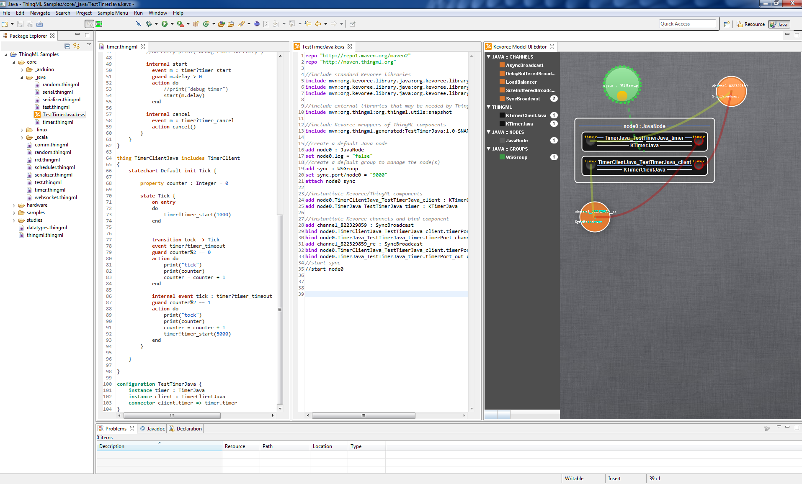

# HEADS IDE

The HEADS IDE is a set of Eclipse plugins, which provides languages and tools for designing and operating Heterogeneous and Distributed (HD) services.

Complete Eclipse bundles, integrating the HEADS languages, frameworks and tools are [available for download](https://ci.inria.fr/k3al/view/Tous/job/headside/ws/products/target/products/):

- [Linux 64 bits](https://ci.inria.fr/k3al/view/Tous/job/headside/ws/products/target/products/heads_ide-linux.gtk.x86_64.zip)
- [Linux 32 bits](https://ci.inria.fr/k3al/view/Tous/job/headside/ws/products/target/products/heads_ide-linux.gtk.x86.zip)
- [MacOS X (64 bits)](https://ci.inria.fr/k3al/view/Tous/job/headside/ws/products/target/products/heads_ide-macosx.cocoa.x86_64.zip)
- [Windows 64 bits](https://ci.inria.fr/k3al/view/Tous/job/headside/ws/products/target/products/heads_ide-win32.win32.x86_64.zip)
- [Windows 32 bits](https://ci.inria.fr/k3al/view/Tous/job/headside/ws/products/target/products/heads_ide-win32.win32.x86.zip)

Just unzip the file corresponding to your OS, and you are ready to go!

