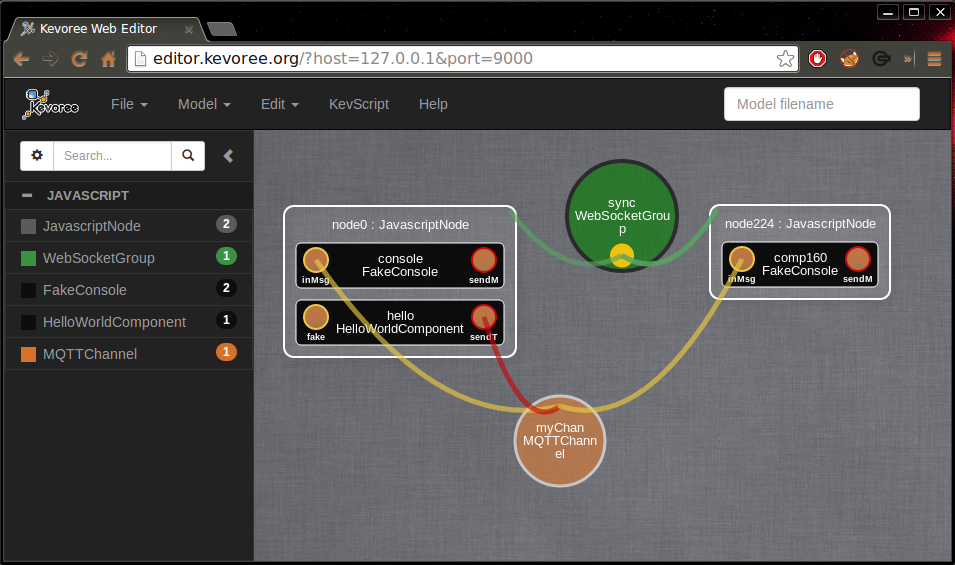

# Re-deploy/adapt/reconfigure a running HD-Service

In order to reconfigure a Kevoree model and trigger adaptations of your system after re-deployment you need a
 `Kevoree Editor` ([Java Editor](http://oss.sonatype.org/service/local/artifact/maven/redirect?r=public&g=org.kevoree.tools&a=org.kevoree.tools.ui.editor&v=RELEASE) 
or [Web Editor](http://editor.kevoree.org)) and some knowledge of the Kevoree Script ([KevScript](http://kevoree.github.io/kevoree-book/kevoree_script_aka_kevscript/README.html)) language.

## Using the Java Editor
> **todo**

## Using the Web Editor
> You need to have a group providing a WebSocket endpoint in order to pull/push your models with the Kevoree Web Editor
 (i.e WSGroup - Java platform or WebSocketGroup - JavaScript platform)  

### Pulling your model
Open a Web browser to this location: `http://editor.kevoree.org/?host=SOME_HOST&port=SOME_PORT`  
This will automatically pull the model using WebSocket and the `host:port` you specified in the URL parameters.  
Now you should have your model displayed in the editor.  

### Reconfigure your model  
#### Using KevScript  
If you open the KevScript editor (using the button in the top panel) the content is updated to reflect your current 
model content.  
You can edit this KevScript directly and then press **Run** so that it modifies your model.  
Once you are done reconfiguring your model you are going to want to deploy it. (You can skip to **Re-deploy your model**)

#### Using the graphical editor  
> **todo**

### Re-deploy your model  
To deploy your model you just have to click on the node you want to deploy the model to.  
You now have its properties displayed in a pop-up window (instance name, dictionary attributes, network settings). 
Because you pulled your model directly from your node in the first you don't have to specify the network settings to 
push a model to it.  
You can just simply press the **Push** button, and your reconfigured model will be send to your Kevoree platform and it 
will make the necessary adaptations.